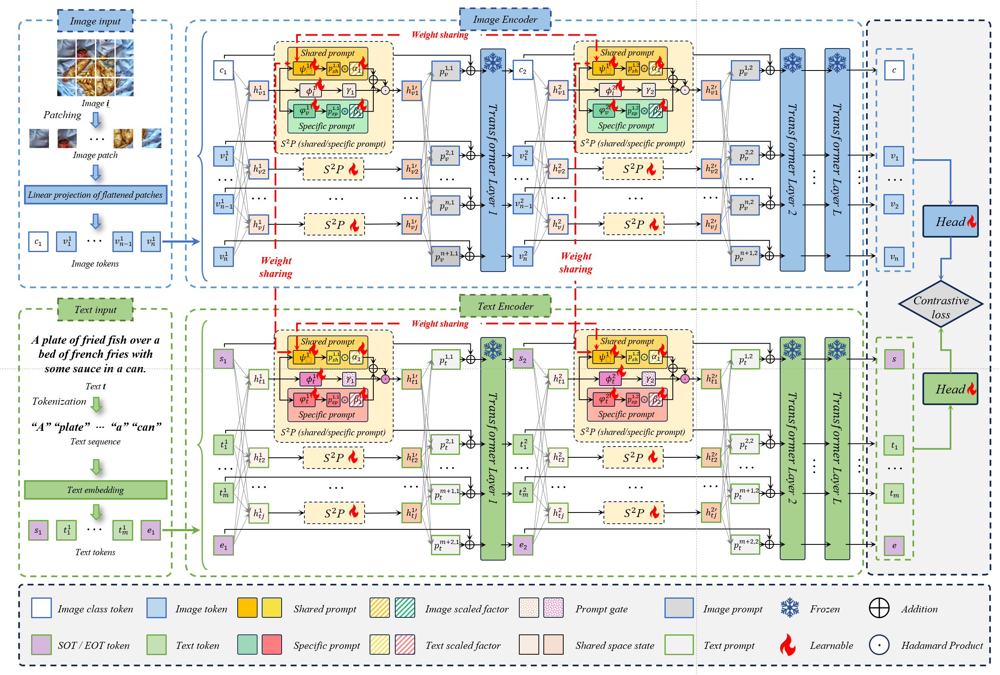

# $S^2P$: Bridging the Modality Gap by Learning What to Share and What to Specify
## Oeverview
We propose $S^2P$ (Shared-Specific Prompt), a novel cross-modal paradigm designed to \textit{bridge the modality gap by learning what to share and what to specify}. Instead of concatenating additional tokens, $S^2P$ introduces additive token-wise prompting, where each token $x_i$ is directly modulated as $x_i + p_i$. This structure-preserving design maintains CLIP’s original token topology while enabling fine-grained, context-aware adaptation.

## Environment Installation


<details>
<summary>For training and limited evaluation</summary>

```bash
# python >= 3.9
pip install torch==2.0.1 torchvision==0.15.2 torchaudio==2.0.2 --index-url https://download.pytorch.org/whl/cu118
pip install transformers sentence-transformers tqdm scikit-learn ftfy
```

</details>

## Data Preprocessing

<details>
<summary>
Image Text Retrieval training/evaluation
</summary>

You should see albef (https://github.com/salesforce/ALBEF) to build a dataset.

For more data examples, 

Here is the data format:
`train.json`
```json
[
  {
        "image_path": "<absPath>/COCO_val2014_000000391895.jpg",
        "caption": "A man with a red helmet on a small moped on a dirt road. ",
        "image_id": "COCO_val2014_000000391895.jpg"
  },
]
```

## Tasks
### Training
```bash
# For COCO:
CUDA_VISIBLE_DEVICES=0,1,2,3 torchrun --nproc_per_node=4 --master-port 15160 retrieval.py --config "./configs/vitb32/coco/s2p.yaml"

# For Flick30k:
CUDA_VISIBLE_DEVICES=0,1,2,3 torchrun --nproc_per_node=4 --master-port 15160 retrieval.py --config "./configs/vitb32/flickr/s2p.yaml"
